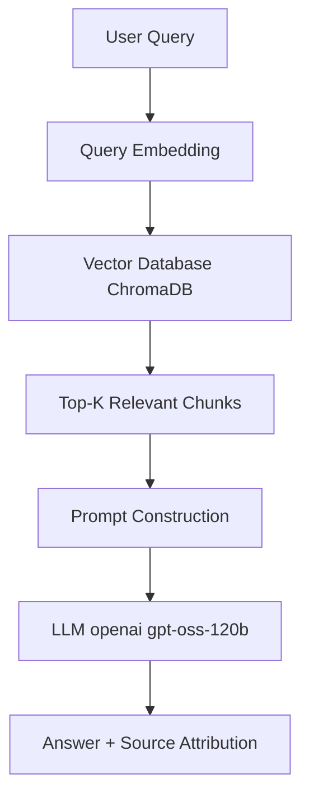
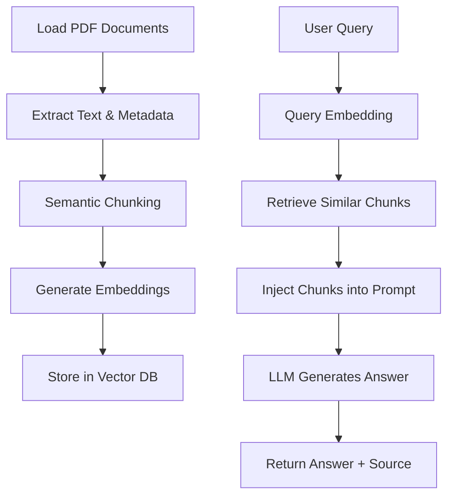

# Mini RAG System Documentation

Welcome to the documentation for your Mini RAG (Retrieval-Augmented Generation) System for Document Question Answering. This solution implements a robust, production-aligned pipeline that combines semantic retrieval, chunking, and LLM-based reasoning, with a strict focus on grounded, explainable answers.

---

# 🏗️ Architecture Overview

This system answers user questions using only the information found in a set of provided PDF documents. The process consists of:

- PDF loading and metadata extraction
- Semantic chunking
- Embedding generation and vector storage (ChromaDB)
- Query embedding and semantic retrieval
- Prompt construction with retrieved context
- LLM reasoning strictly over the retrieved chunks

## System Architecture



> **Key Principle:**  
> The LLM *never* answers from its own internal knowledge. Answers are always grounded in the retrieved document context.

---

# 🔄 Workflow Diagram

This step-by-step workflow visualizes the entire RAG pipeline:



---

# 📦 Project Structure & File Responsibilities

| File                | Purpose                                                        |
|---------------------|----------------------------------------------------------------|
| `.env`              | Stores HuggingFace API token                                   |
| `requirements.txt`  | Lists required Python dependencies                             |
| `__init__.py`       | Denotes directory as a Python package                          |
| `Loader.py`         | Loads PDFs from a given directory                              |
| `chunk.py`          | Splits documents into semantically meaningful chunks           |
| `embeding_db.py`    | Embedding model loader and vector DB creation                  |
| `llm.py`            | Model evaluation and LLM interaction logic                     |
| `main.py`           | Streamlit application entry point                              |
| `Rag_app.py`        | RAG prompt and answer-query function                           |

---

# 📂 .env

This file stores your HuggingFace API token, required for accessing HuggingFace-hosted models.

```env
HUGGINGFACEHUB_API_TOKEN= [Starts with hf]
```

- **Purpose:** Securely store credentials.
- **Usage:** Loaded by `dotenv` in code, required for LLM endpoint access.

---

# ⚙️ requirements.txt

Lists all dependencies needed to run the system.

```txt
langchain
langchain_core
langchain-community
pymupdf
sentence-transformers
#embedding model
chromadb
langchain-chroma
langchain-huggingface
huggingface_hub
python-dotenv
streamlit
```

- **Purpose:** Declarative environment setup.
- **Notable Packages:**
  - `langchain`, `langchain-core`, `langchain-community`: RAG framework
  - `sentence-transformers`: For semantic chunking & embeddings
  - `chromadb`: Fast vector DB with metadata support
  - `streamlit`: UI for interactive question answering
  - `python-dotenv`: Loads `.env` file securely

---

# 📦 __init__.py

```python

```

- **Purpose:** Marks the directory as a package.
- **Usage:** No logic; required for Python imports.

---

# 📄 Loader.py

Handles PDF loading and document extraction using LangChain community loaders.

```python
from langchain_community.document_loaders import PyMuPDFLoader, DirectoryLoader

def load_pdfs(pdf_dir: str):
    """
    Load all PDF documents from a directory.
    Returns a list of LangChain Document objects.
    """
    loader = DirectoryLoader(
        pdf_dir,
        glob="**/*.pdf",
        loader_cls=PyMuPDFLoader
    )
    documents = loader.load()
    return documents
```

- **Purpose:** Loads all PDF files from a directory, extracting both text and metadata.
- **Key Features:**
  - Preserves page-level metadata (critical for source attribution)
  - Scalable to many PDFs

---

# ✂️ chunk.py

Provides semantic chunking logic using Sentence Transformers.

```python
from langchain_text_splitters import RecursiveCharacterTextSplitter, SentenceTransformersTokenTextSplitter

def semantic_split_documents(
    documents,
    model_name: str = "sentence-transformers/all-MiniLM-L6-v2",
    chunk_size: int = 500
):
    """
    Semantic chunking using sentence-transformer embeddings.
    """
    splitter = SentenceTransformersTokenTextSplitter(
        model_name=model_name,
        chunk_size=chunk_size,
        chunk_overlap=0
    )
    semantic_chunks = []
    for doc in documents:
        for chunk in splitter.split_text(doc.page_content):
            semantic_chunks.append(
                doc.__class__(
                    page_content=chunk,
                    metadata=doc.metadata
                )
            )
    return semantic_chunks
```

- **Purpose:** Splits documents into semantically meaningful text chunks.
- **Why semantic chunking?**
  - Preserves meaning across sentence boundaries.
  - Reduces chances of splitting explanations or tables.
- **Alternatives (not used):**
  - Fixed-size chunking (context-blind)
  - Recursive chunking (can break related content)

---

# 🧬 embeding_db.py

Loads the embedding model and constructs a persistent vector database.

```python
import os
from langchain_huggingface import HuggingFaceEmbeddings
from langchain_community.vectorstores import Chroma

def load_embedding_model(
    model_name: str = "sentence-transformers/all-MiniLM-L6-v2"
):
    """
    Load HuggingFace embedding model.
    """
    return HuggingFaceEmbeddings(model_name=model_name)

def create_vector_db(
    chunks,
    embeddings,
    persist_directory: str = "/db/chroma_db"
):
    """
    Create a Chroma vector database from chunks.
    """
    os.makedirs(persist_directory, exist_ok=True)
    vectordb = Chroma.from_documents(
        documents=chunks,
        embedding=embeddings,
        persist_directory=persist_directory
    )
    return vectordb
```

- **Purpose:** 
  - Loads the recommended sentence-transformer for semantic embeddings.
  - Stores chunks in a local, persistent ChromaDB instance.
- **Why ChromaDB?**
  - Efficient, local, supports metadata for source attribution.

---

# 🧠 llm.py

Performs model evaluation and interacts with the HuggingFace-based language model for explanation generation.

```python
import os
import json
from dotenv import load_dotenv
from langchain.schema import HumanMessage
from langchain_huggingface import HuggingFaceEndpoint, ChatHuggingFace
from train_ml import train_ml
from train_mlp import train_mlp

# Load ENV
load_dotenv()
HF_TOKEN = os.getenv("HUGGINGFACEHUB_API_TOKEN")
if not HF_TOKEN:
    raise ValueError("HUGGINGFACEHUB_API_TOKEN not found in .env")

# Get REAL metrics
ml_metrics = train_ml()
dl_metrics = train_mlp()

# Select final model (F1-based)
if ml_metrics["f1"] >= dl_metrics["f1"]:
    final_model = ml_metrics
    selected_model = ml_metrics["model"]
    comparison_text = (
        "Random Forest achieved a higher F1-score than the MLP model."
    )
else:
    final_model = dl_metrics
    selected_model = dl_metrics["model"]
    comparison_text = (
        "MLP achieved a higher F1-score than the Random Forest model."
    )

# Build TEXT INPUT (PROMPT)
prompt = f"""
You are an AI assistant explaining a loan approval decision.
Model Evaluation Results:
- Random Forest F1-score: {ml_metrics['f1']}
- MLP (ANN) F1-score: {dl_metrics['f1']}
Decision Rule: The final model is selected strictly based on F1-score.
Selected Model: {selected_model}
Return ONLY valid JSON in the following format:
{{
  "prediction": "Loan Approved or Loan Rejected",
  "confidence": "{final_model['confidence']}",
  "ml_vs_dl_comparison": "{comparison_text}",
  "llm_explanation": "Clear, non-technical explanation"
}}
"""

# REAL LLM (LangChain + HF)
endpoint = HuggingFaceEndpoint(
    repo_id="openai/gpt-oss-120b",
    task="conversational",
    huggingfacehub_api_token=HF_TOKEN,
    max_new_tokens=300,
    temperature=0.2,
)
chat_llm = ChatHuggingFace(llm=endpoint)
response = chat_llm.invoke([HumanMessage(content=prompt)])
raw_text = response.content

# Parse JSON
json_start = raw_text.find("{")
json_end = raw_text.rfind("}") + 1
llm_output = json.loads(raw_text[json_start:json_end])

# Save Output
os.makedirs("../outputs", exist_ok=True)
with open("../outputs/final_output.json", "w") as f:
    json.dump(llm_output, f, indent=4)

print("REAL metrics + REAL LLM used")
print(json.dumps(llm_output, indent=4))
```

- **Purpose:** 
  - Runs both ML and DL models, compares F1 scores, and prompts the LLM to generate a JSON-formatted explanation.
  - Uses the HuggingFace API for the LLM.
- **Notable:** 
  - Designed for transparent, explainable outputs.

---

# 🚀 main.py

Entry point for the Streamlit UI application.

```python
import streamlit as st
from Loader import load_pdfs
from chunk import semantic_split_documents
from embeding_db import load_embedding_model, create_vector_db
from llm import load_llm
from Rag_app import answer_query

@st.cache_resource
def initialize_rag():
    documents = load_pdfs("data/pdf")
    semantic_chunks = semantic_split_documents(
        documents, model_name="sentence-transformers/all-MiniLM-L6-v2"
    )
    embeddings = load_embedding_model()
    vector_db = create_vector_db(semantic_chunks, embeddings)
    llm_instance = load_llm()
    return vector_db, llm_instance

vector_db, llm = initialize_rag()

st.title(" RAG Document Assistant")
query = st.text_input("Ask a question")
if query:
    answer, docs = answer_query(query, vector_db, llm)
    st.write(answer.content)
    st.subheader("Sources")
    for doc in docs:
        st.write(
            f"- {doc.metadata.get('source')}"
        )
```

- **Purpose:** 
  - Provides an interactive web UI.
  - Handles all pipeline stages from document loading to answer display.
- **Workflow:**
  1. Loads and preprocesses PDFs
  2. Handles user queries
  3. Displays both answer and sources

---

# 🎯 Rag_app.py

RAG prompt definition and answer generation logic.

```python
from langchain_core.prompts import ChatPromptTemplate

RAG_PROMPT = ChatPromptTemplate.from_messages([
    (
        "system",
        # Persona and objective
        "You are an assistant who understands context and answers to questions"
        "**If the answer is not found, say: Information not found in the provided documents.***"
        # critical operation rule
        "- never mention you are ai "
        "- try to be more accurate with provided context"
        "- answer only if context is provided to you"
        "- never answer to query like :- Based on the context provided ......"
        "- never answer out of the scope/context (example:- query= where is belagavi , answer ='Information not found in the provided documents ' "
    ),
    (
        "human",
        "Context:\n{context}\n\nQuestion:\n{question}"
    )
])

def answer_query(query, vector_db, llm, k=3, metadata_filter=None):
    if metadata_filter:
        docs = vector_db.similarity_search(
            query, k=k, filter=metadata_filter
        )
    else:
        docs = vector_db.similarity_search(query, k=k)
    context = "\n\n".join(doc.page_content for doc in docs)
    messages = RAG_PROMPT.format_messages(
        context=context, question=query
    )
    answer = llm.invoke(messages)
    return answer, docs
```

- **Purpose:** 
  - Enforces context-grounded answers only.
  - Prevents hallucinations and out-of-context responses.
- **Prompt Logic:** 
  - Explicit instructions to never answer using internal LLM knowledge.
  - If no answer is found, returns a clear fallback message.

---

# 🖥️ API Endpoints

The Streamlit-based UI handles queries interactively, but the architecture and code pattern can be adapted to REST APIs. For documentation, here’s what the endpoints would look like if exposed as REST APIs:

## /ask (POST) – Ask a Question

### "Ask a Question" Endpoint (POST /ask)

```api
{
    "title": "Ask a Question",
    "description": "Submit a question to the RAG system. Returns a grounded answer with source attribution.",
    "method": "POST",
    "baseUrl": "https://your-rag-app.example.com",
    "endpoint": "/ask",
    "headers": [
        {
            "key": "Content-Type",
            "value": "application/json",
            "required": true
        }
    ],
    "queryParams": [],
    "pathParams": [],
    "bodyType": "json",
    "requestBody": "{\n  \"question\": \"What is the loan approval process?\"\n}",
    "responses": {
        "200": {
            "description": "Success",
            "body": "{\n  \"answer\": \"The loan approval process involves...\",\n  \"sources\": [\n    { \"source\": \"loan_policy.pdf\", \"page\": 4 },\n    { \"source\": \"loan_policy.pdf\", \"page\": 7 }\n  ]\n}"
        },
        "404": {
            "description": "No Answer Found",
            "body": "{\n  \"answer\": \"Information not found in the provided documents.\",\n  \"sources\": []\n}"
        }
    }
}
```

---

# 🧩 Key Engineering Takeaways

```card
{
  "title": "Semantic Chunking Matters",
  "content": "High-quality, meaning-preserving chunks improve retrieval accuracy and answer quality."
}
```

```card
{
  "title": "Grounded Reasoning Only",
  "content": "LLM is strictly limited to context from retrieved document chunks, preventing hallucination."
}
```

```card
{
  "title": "Local, Explainable RAG",
  "content": "ChromaDB and sentence-transformers provide efficient, local semantic search with transparent source attribution."
}
```

---

# 📝 Summary

This Mini RAG project demonstrates production-aligned design for document-grounded question answering:

- Semantic chunking for high retrieval quality
- ChromaDB for efficient, metadata-rich vector storage
- Streamlit UI for interactive QA
- LLM reasoning strictly over provided context

All engineering decisions were made based on real-world trade-offs for reliability, transparency, and simplicity.

---

# 🎓 Further Reading

- [LangChain RAG Tutorials](https://python.langchain.com/docs/use_cases/question_answering)
- [ChromaDB Documentation](https://docs.trychroma.com/)
- [Sentence Transformers](https://www.sbert.net/)
- [Streamlit Documentation](https://docs.streamlit.io/)

---

# 🚫 Failure Modes

**Expected Failure:**  
If a query is out-of-domain (e.g., "Explain quantum entanglement" when not present in any PDF), the system safely returns:

> "Information not found in the provided documents."

This confirms that the system is robust against hallucination and only answers from the provided knowledge base.
